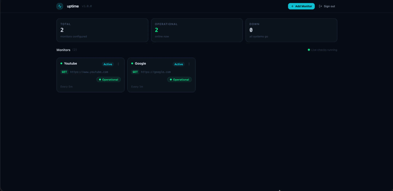

# Uptime Monitor

A self-hosted uptime monitoring platform for tracking HTTP endpoint availability and latency — in the spirit of Pingdom or Better Uptime, but fully under your control.

You configure monitors (URL, method, frequency, timeout). A background worker probes them on a schedule, stores every check as a heartbeat, and the dashboard shows live status, 24h uptime, latency charts, and recent check history.



## Why this architecture

The system splits into a **control plane** and a **data plane** so probing never competes with user traffic:

| Plane | Process | Responsibility |
|-------|---------|----------------|
| Control | `cmd/api` | Auth, monitor CRUD (REST), analytics (GraphQL) |
| Data | `cmd/worker` | Scheduled HTTP probes, heartbeat writes, WebSocket status events |
| UI | `frontend` | Dashboard and monitor detail views |

Probes run in a separate process with their own connection pool and worker pool. API request latency stays predictable even when hundreds of targets are being checked.

```
┌────────────────────┐
│  React + Vite UI   │
└─────────┬──────────┘
          │ REST (auth / CRUD)
          │ GraphQL (24h stats / history)
          │ WebSocket (up/down transitions)
          ▼
┌────────────────────┐         ┌─────────────────────┐
│   API service      │◄───────►│  PostgreSQL         │
│   Chi + gqlgen     │         │  users / monitors /  │
└────────────────────┘         │  heartbeats         │
                               └──────────▲──────────┘
                                          │
                               ┌──────────┴──────────┐
                               │  Worker service     │
                               │  ticker → channel → │
                               │  probe pool → hub   │
                               └─────────────────────┘
```

## Technologies

**Backend (Go)**
- Standard `net/http` + [Chi](https://github.com/go-chi/chi) routing
- [gqlgen](https://gqlgen.com/) for schema-first GraphQL
- JWT auth + bcrypt password hashing
- [gorilla/websocket](https://github.com/gorilla/websocket) for live state push
- PostgreSQL via `database/sql` + pgx driver
- [golang-migrate](https://github.com/golang-migrate/migrate) for schema migrations

**Frontend (TypeScript)**
- React 19 + Vite
- Tailwind CSS
- Apollo Client for GraphQL
- Recharts for latency history
- React Hook Form + Zod for forms

**Infrastructure**
- Docker Compose for local Postgres + migrations

## Architectural highlights

### 1. Control plane vs data plane

`cmd/api` never opens outbound probe connections. `cmd/worker` never serves the dashboard CRUD surface. That separation keeps monitoring load isolated from interactive API work and makes each process independently scalable.

### 2. Dual API styles by workload

- **REST (`/api/v1/...`)** — authentication and monitor configuration (create, list, get, update, delete). Simple request/response fits CRUD well.
- **GraphQL (`/query`)** — monitor detail analytics: 24h uptime percentage, average latency, and heartbeat history in one typed query. The playground is available at `/graphql`.

### 3. Concurrent probe pipeline

The worker is built around Go concurrency primitives:

1. A **ticker** periodically loads active monitors.
2. Monitors are pushed onto a buffered **channel**.
3. A fixed **worker pool** of goroutines pulls jobs, issues HTTP probes with timeouts, and emits heartbeats.
4. Results are persisted, `is_up` is updated, and **state transitions** (up ↔ down) are broadcast over WebSockets to the owning user.

This avoids spawning unbounded goroutines per tick and keeps probe concurrency bounded by the pool size.

### 4. Domain-oriented backend packages

Business logic lives under `backend/internal/` by domain — `auth`, `monitor`, `hearbeat`, `worker`, `notification`, `graph` — with clear handler → service → repository layers. Services depend on repository interfaces, which keeps transport concerns out of core rules.

### 5. Real-time status without polling the probe path

When a monitor flips availability, the worker publishes a topic message keyed by `user_id`. Connected clients on `/ws/states` receive the event immediately, so the UI can react without waiting for the next REST/GraphQL refresh.

## Project layout

```
uptime-monitor/
├── backend/
│   ├── cmd/api/          # REST + GraphQL control plane
│   ├── cmd/worker/       # Probe scheduler + WebSocket hub
│   ├── internal/         # Domain packages (auth, monitor, graph, …)
│   ├── db/migrations/    # SQL migrations
│   └── pkg/database/     # DB connection helper
├── frontend/             # React dashboard
├── docker-compose.yml    # Postgres + migrate
└── .env.example
```

## Prerequisites

- [Docker](https://docs.docker.com/get-docker/) and Docker Compose
- [Go](https://go.dev/dl/) 1.26+
- [Node.js](https://nodejs.org/) 22+ and [pnpm](https://pnpm.io/)
- [golang-migrate CLI](https://github.com/golang-migrate/migrate) (optional — only if you prefer Makefile migrations over Docker)

## Local setup

### 1. Clone and configure

```bash
git clone https://github.com/publiosilva/uptime-monitor.git
cd uptime-monitor
cp .env.example .env
cp backend/.env.example backend/.env
```

Root `.env` configures Postgres for Compose. `backend/.env` configures the API and worker:

| Variable | Default | Purpose |
|----------|---------|---------|
| `API_PORT` | `3333` | Control plane HTTP port |
| `WS_PORT` | `3334` | Worker WebSocket port |
| `DATABASE_URL` | local Postgres URL | Shared by API and worker |
| `JWT_SECRET` | — | Required; change in production |

### 2. Start PostgreSQL and migrate

```bash
docker compose up -d
docker compose logs migrate   # expect init schema applied
```

Verify tables (`users`, `monitors`, `heartbeats`, `schema_migrations`):

```bash
docker compose exec postgres psql -U uptime -d uptime_monitor -c '\dt'
```

### 3. Run the API

```bash
cd backend
go run ./cmd/api
```

API: `http://localhost:3333` · GraphQL playground: `http://localhost:3333/graphql`

### 4. Run the worker

In another terminal:

```bash
cd backend
go run ./cmd/worker
```

WebSocket endpoint: `ws://localhost:3334/ws/states`

### 5. Run the frontend

```bash
cd frontend
pnpm install
pnpm run dev
```

Vite proxies `/api` and `/query` to the API during development.

## Database migrations

Files live in `backend/db/migrations/` (`NNNNNN_name.up.sql` / `.down.sql`).

**Docker Compose (default):** `docker compose up -d` applies pending migrations.

**Makefile** (requires golang-migrate CLI), from `backend/`:

```bash
make migrate-up
make migrate-down
make migrate-version
make migrate-create
```

## Stopping services

```bash
docker compose down        # stop Postgres
docker compose down -v     # also wipe the database volume
```

## License

See repository license if present; otherwise treat as private unless published otherwise.
